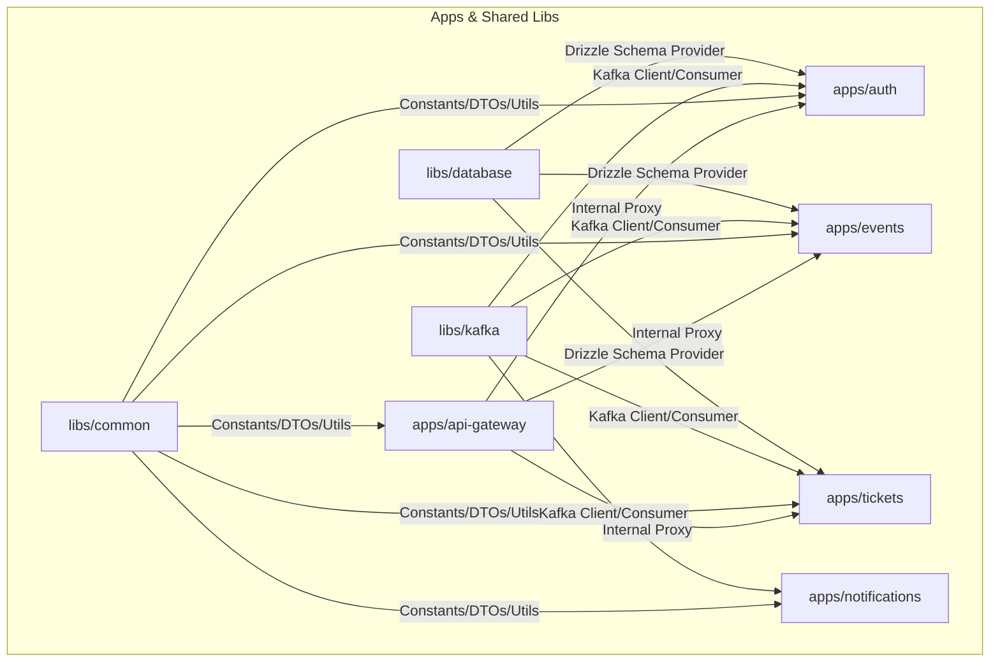
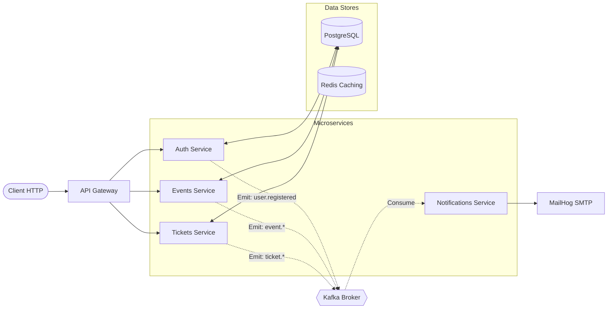

# NexiVent: Scalable Event & Ticket Management Microservices

A high-performance event management system built with a microservices architecture for handling authentication, event creation, ticket sales, and automated notifications.

### Tech Stack
* **Framework**: [NestJS](https://nestjs.com/) (Node.js)
* **Database**: [PostgreSQL](https://www.postgresql.org/) with [Drizzle ORM](https://orm.drizzle.team/)
* **Messaging**: [Apache Kafka](https://kafka.apache.org/)
* **Caching**: [Redis](https://redis.io/)
* **Language**: [TypeScript](https://www.typescriptlang.org/)
* **DevOps**: [Docker](https://www.docker.com/) & [Docker Compose](https://docs.docker.com/compose/)
* **Mailing**: [MailHog](https://github.com/mailhog/MailHog) (Development)

### 🚀 Monorepo Local Setup

#### 1. Prerequisites
* **Node.js**: >= 22.x
* **Container Runtime**: Docker & Docker Compose

#### 2. Infrastructure Up-Time
Boot up localized instances of PostgreSQL, Apache Kafka, Redis, and MailHog:
```bash
docker-compose up -d
```

#### 3. Workspace Provisioning
```bash
# Install root and workspace dependencies securely
npm clean-install

# Seed environmental templates
cp .env.example .env
```

#### 4. Database Schema Generation & Migration
Generate and execute type-safe SQL statements using Drizzle-Kit:
```bash
# Generate SQL migrations based on TypeScript schemas
npx drizzle-kit generate

# Apply migrations directly to the local PostgreSQL instance
npx drizzle-kit migrate
```

#### 5. Launch Targeted Microservice Applications
Boot services using targeted NestJS CLI workspace parameters:
```bash
# Boot all services concurrently
npm run start:dev

# Boot individual applications
npm run start:dev api-gateway
npm run start:dev auth
npm run start:dev events
npm run start:dev tickets
npm run start:dev notifications
```

### 🏗️ Monorepo Architecture & Visuals

#### Workspace Structure


#### Event & Context Boundaries


### 📂 Architecture Map
```text
📂 nexivent/
├── 📁 apps/
│   ├── 📁 api-gateway/     # Entry point for client requests, routes to microservices
│   ├── 📁 auth/            # Identity management, JWT issuance, and validation
│   ├── 📁 events/          # Event lifecycle management (Create, Update, List)
│   ├── 📁 notifications/   # Email dispatching via Kafka consumers
│   └── 📁 tickets/         # Ticket issuance and reservation logic
├── 📁 libs/
│   ├── 📁 common/          # Shared DTOs, interfaces, constants, and utils
│   ├── 📁 database/        # Drizzle ORM schema definitions and database service
│   └── 📁 kafka/           # Shared Kafka client registration and message patterns
├── 📄 docker-compose.yaml  # Infrastructure definition for local development
└── 📄 drizzle.config.ts    # Drizzle ORM configuration
```

### Environment Variables

| Variable | Type | Description | Required | Default |
| :--- | :--- | :--- | :--- | :--- |
| `KAFKA_BROKER` | String | List of Kafka broker addresses | No | `localhost:9093` |
| `JWT_SECRET` | String | Secret key for signing JWT tokens | No | `secret` |
| `SMTP_HOST` | String | SMTP server host for notifications | No | `localhost` |
| `SMTP_PORT` | Number | SMTP server port for notifications | No | `1025` |
| `DATABASE_URL` | String | Postgres connection string | **Yes** | N/A |

